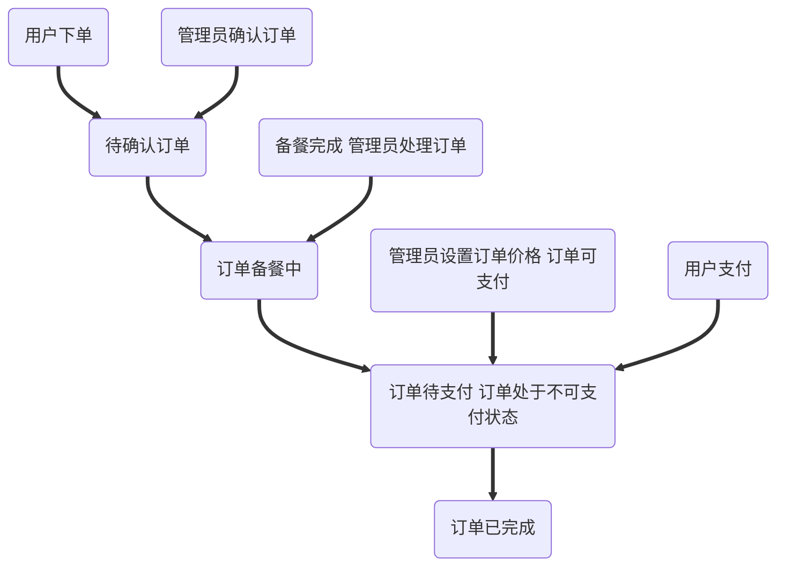
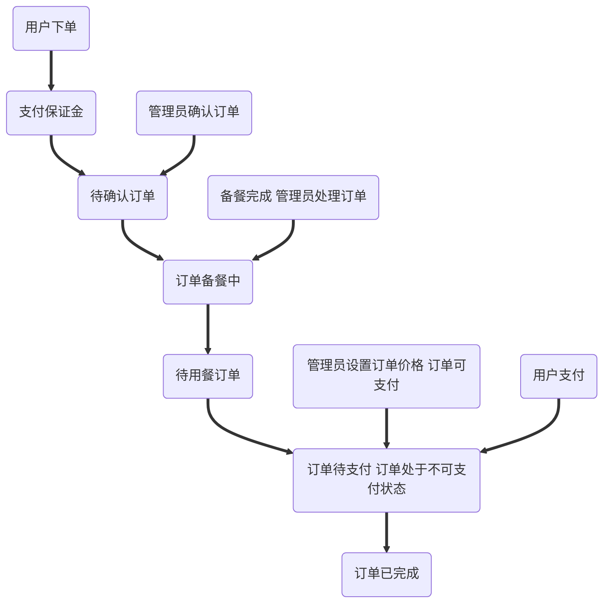
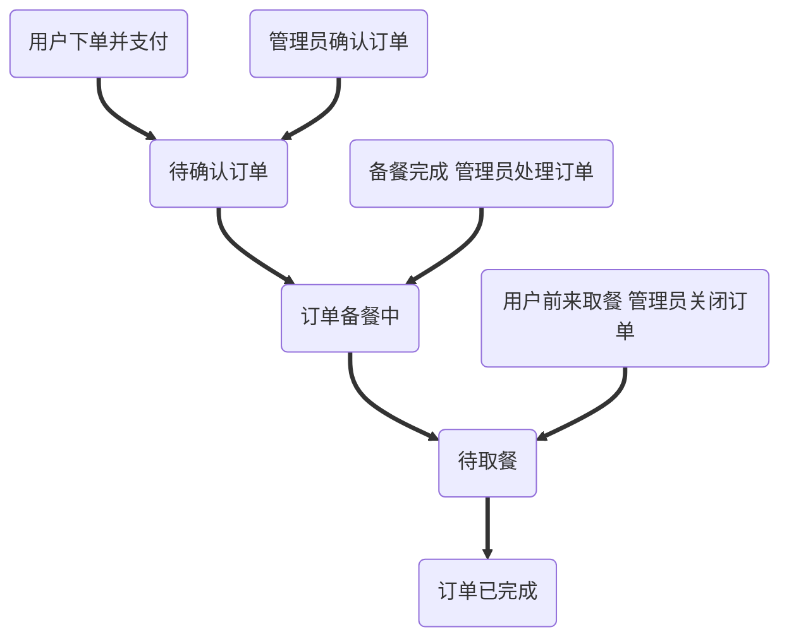
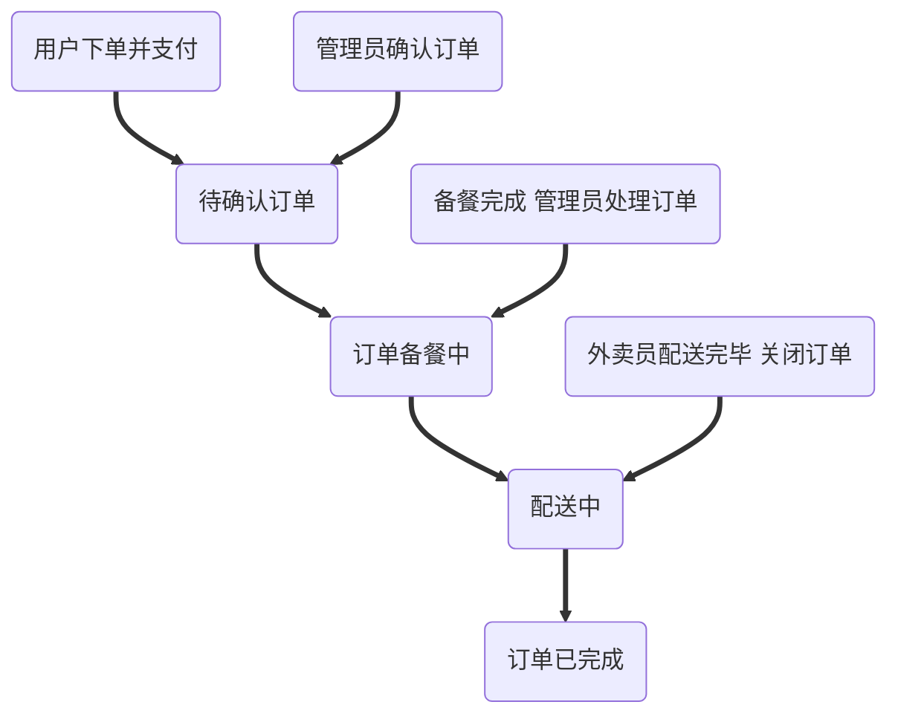

[toc]

## 菜品

### 菜品列表

**可编辑表项**：

- 编号
- 名称
- 图片
- 原价
- 描述
- 主料
- 辅料
- 凉热
- 制作方法
- 分量
- 制作时长

### 套餐列表

**可编辑表项**：

- 编号
- 套餐名称
- 菜品编号 * 数量(可通过查询名称确认)

## 订单流程

- 编号 - 提交时间 - 消费门店 - 消费方式 - 用户ID - (待)支付金额 - 桌号 - 订单状态 - 操作

  

### 扫码点餐

### 到店消费

### 到店自取

### 外卖配送(暂不支持)

### 总结

订单状态共有如下几种:

1. 待点餐(保留以后使用)
2. 待支付
3. 确认中
4. 备餐中
5. 待用餐
6. 待取餐
7. 配送中
8. 已完成
9. 取消确认中
10. 已取消

其中需要管理员处理的订单有：

1. 待支付 === 设置是否可以支付
2. 确认中 === 确认订单，然后开始处理订单
3. 备餐中 === 确认备餐完成，转移至下一状态
4. 待取餐 | 配送中 === 完成后需要管理员关闭订单
5. 取消确认中 === 需要管理员审批